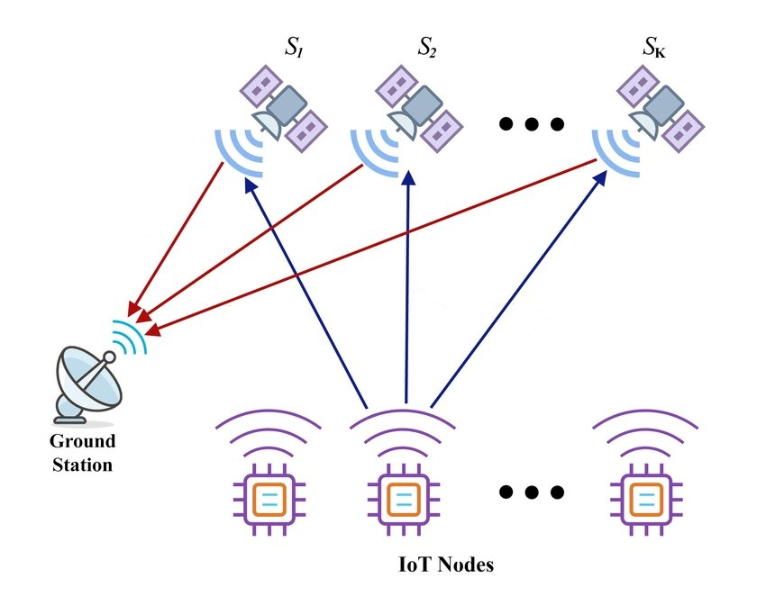

# Ejercicio CiberKillChain - Ataque

Hacer una copia de este documento para utilizar com plantilla para el ejercicio quitando las instrucciones y el ejemplo.

## Alumno

(completar)

## Enunciado

Armar una cyberkillchain usando técnicas de la matriz de Att&ck para un escenario relacionado al trabajo práctico de la carrera.

### Instrucciones

Debe haber un objetivo para el ataque.

El escenario debe ser con el sistema ya funcionando en el futuro.

Debe ser en primera persona, es el punto de vista del atacante.

Es recomendable hacer dos o tres pasadas, en la primera la idea, en las siguientes refinamientos especificando las técnicas.
PURO ATAQUE, nada de andar pensando cómo corregir nada.

Para cada etapa, si hay varias medidas posibles, ordenar dejando para lo último lo que se va a hacer en el siguiente paso.

### Ejemplo adaptado a un juego de guerra inventado:

Objetivo del ataque: inhabilitar sin destruir el puerto enemigo con vistas a posteriormente tomarlo.

* Reconnaissance
  - Imagen satelital identifica una pista de aterrizaje.
  - Espías dicen que por el puerto entra el combustible.
  - Espías locales dicen que la playa cercana no tiene buena vigilancia.

* Weaponization
  - Puedo preparar un bombardeo.
  - Decido preparar un equipo de comandos de sabotage.
  
* Delivery
  - Envío al equipo de sabotage a la playa cercana en submarino.
  
* Exploit
  - El equipo logra desembarcar sin incidentes en la playa.
  
* Installation  
  - El equipo se hace pasar por una compañia de circo como camuflaje.

* Command & Control
  - Podría utilizar palomas mensajeras.
  - Decido utilizar Super High TeraHertz Radio que el adversario no puede detectar.
  
* Actions on Objectives
  - El equipo de comandos provoca daños menores en las cañerías.
  - El equipo de comandos coloca minas en el puerto dejando un camino para el desembarco.
  

## Datos trabajo práctico

El objetivo de este trabajo final de Maestría es el diseño y desarrollo del software de vuelo para un nanosatélite. El MDQSAT-1 es un CubeSat de 0.5U que se encuentra siendo desarrollado por parte de la empresa Innova Space. Tal como establece el estándar, sus dimensiones no superan los 10cm x 10cm x 5cm y su peso es inferior a los 500g. Concebido como una prueba de concepto, la misión del MDQSAT-1 es validar diseños y componentes claves de la arquitectura de una plataforma satelital para una constelación de pequeños satélites, que brindará servicio de comunicaciones a dispositivos IoT.

### Diagrama:

.

## Resolución

### Objectivo del ataque

El objetivo del ataque es simular el mal funcionamiento de los nodos de usuario o incluso del mismo satélite, mediante la inyección de telemetría falsa en el sistema. Además, dada la capacidad bidireccional de las comunicaciones entre satélite y nodos de usuario, con este ataque sería posible enviar telecomandos a los nodos de usuario.

### Reconnaissance

- [[T1591] 	Gather Victim Org Information](https://attack.mitre.org/techniques/T1591): Se estudia la información obtenida de fuentes abiertas y se da con la arquitectura de la solución (Satélite+nodos de GS).

- [[T1590] Gather Victim Network Information ](https://attack.mitre.org/techniques/T1590)
    - [[.004] Network Topology](https://attack.mitre.org/techniques/T1590/004) y [[.005] IP Addresses](https://attack.mitre.org/techniques/T1590/005): Se estudia la topología de la red y se detecta que se usan nodos remotos para la GS. Además, se detecta que se utiliza un servicio de VPN para establecer la comunicación con los nodos.

### Weaponization

- [[T1587] Develop Capabilities](https://attack.mitre.org/techniques/T1587)
    - [[.001] Malware](https://attack.mitre.org/techniques/T1587/001): Se desarrolla un script que será instalado en los nodos de GS. Este script permite publicar mensajes en un broker MQTT, utilizando los certificados instalados en el sistema.

### Delivery

- [[T1566] Phishing](https://attack.mitre.org/techniques/T1566)
    - [[.002] Spearphishing Link](https://attack.mitre.org/techniques/T1566/002): Se envía un correo a los desarrolladores haciéndose pasar por el servicio de VPN y pidiendo que se reestablezca la contraseña.

- [[1078] Valid Accounts](https://attack.mitre.org/techniques/T1078)
    - [[.003] Local Accounts](https://attack.mitre.org/techniques/T1078/003): Con la contraseña de acceso al servicio de VPN, mediante SSH se copia el exploit (backdoor) al objetivo.

### Exploitation

- [[T1059] Command and Scripting Interpreter](https://attack.mitre.org/techniques/T1059)
    - [[.004] Unix Shell](https://attack.mitre.org/techniques/T1059/004): Se utiliza un backdoor de Linux para descargar un script desde un repositorio remoto, encargado de instalar el script de control final. 

### Installation

- [[T1547] Boot or Logon Autostart Execution](https://attack.mitre.org/techniques/T1547) 
    - [[.013] XDG Autostart Entries](https://attack.mitre.org/techniques/T1547/006): Dado que en los nodos remotos se utiliza una distro GNU/Linux, durante la instalación del malware se hace uso del mecanismo proporcionado por XDG para autoconfigurarse en el inicio del sistema.

### Command & Control

- [[T1071] Application Layer Protocol](https://attack.mitre.org/techniques/T1071)
    - [[.002] File Transfer Protocols](https://attack.mitre.org/techniques/T1071/002): El script descripto en la sección **Weaponization** utiliza el protocolo FTP para ser comandado por el atacante. De esta forma, se reduce el riesgo de ser detectado por herramientas de análisis de tráfico.

### Actions on objectives

- [[T0879] Damage to Property](https://attack.mitre.org/techniques/T0879)
    - Se envian telecomandos a los nodos de usuario para afectar el funcionamiento de los mismos o desconfigurarlos.

- [[T0831] Manipulation of Control](https://attack.mitre.org/techniques/T0831)
    - Se envian telecomandos a los nodos de usuario para controlar los sistemas pertenecientes a los usuarios finales.

- [[T0832] Manipulation of View](https://attack.mitre.org/techniques/T0832)
    - Se publican datos falsos en el broker MQTT, simulando un mal funcionamiento en el satélite.
    - Se publican datos falsos en el broker MQTT, simulando un funcionamiento incorrecto de los nodos de usuario.